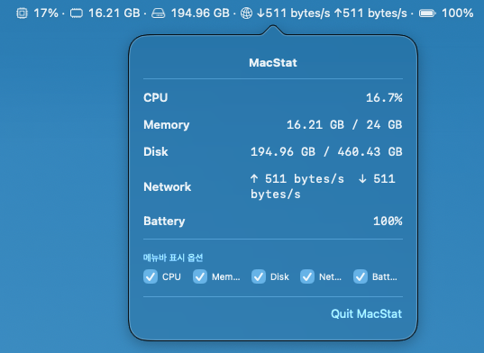

# MacStat



A lightweight, native macOS menu bar application built with Swift and SwiftUI that monitors your system resources in real-time.

## Features

MacStat sits directly in your macOS menu bar and provides live updates using native Apple SF Symbols. You can customize which metrics are visible via the dropdown menu.

*   **CPU Usage** (): Overall CPU load percentage.
*   **Memory Usage** (🀫): Used memory vs Total physical memory.
*   **Disk Usage** (💽): Used space vs Total capacity of the main drive.
*   **Network Activity** (🌐): Real-time network upload and download speeds.
*   **Battery Level** (🔋): Current battery percentage (safely handles desktop Macs like Mac Mini by defaulting to 100%).

## Requirements

*   macOS 13.0 or later
*   Swift 5.9+

## Installation & Running

You can run this application directly from your terminal or package it into a standard macOS application wrapper (`.app`).

**Option 1: Run temporarily via Terminal**
1.  Run the application using Swift Package Manager:
    ```bash
    swift run
    ```

**Option 2: Build a permanent MacStat.app**
1. Build the release binary first:
   ```bash
   swift build -c release
   ```
2. Run the packaging script:
   ```bash
   ./build_app.sh
   ```
   *(This script will automatically take the `base_icon.png`, generate an Apple `.icns` file using macOS built-in tools, and package your `.app` bundle).*
3. A `MacStat.app` folder will be generated. You can now move this `.app` into your `/Applications` folder and even add it to your Login Items to start automatically with macOS!

*Note: You may be prompted by macOS to grant permissions (e.g., Network/Disk access) on the first run, depending on your system's privacy settings.*

## Technical Details

*   **UI Framework**: SwiftUI (`MenuBarExtra` converted to `NSStatusItem` for advanced custom `NSAttributedString` rendering)
*   **System APIs Used**: 
    *   `mach_host_self()` for CPU and Mach VM memory stats.
    *   `ifaddrs` for Network interface bytes.
    *   `FileManager` for Disk space.
    *   `/usr/bin/pmset` for safe battery polling without IOKit compilation issues on desktop Macs.

## License

MIT License
